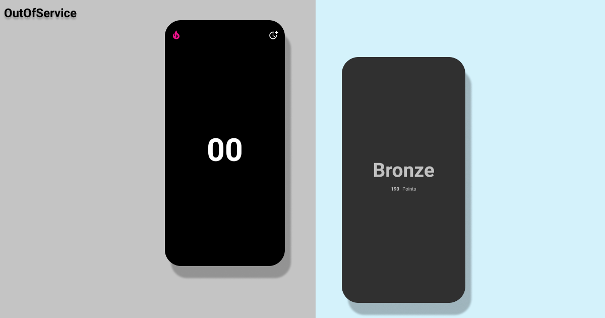

# open-source-android-outofservice

  
  

OutOfService helps you to calm down your mobile usage.

## Working

1. Add time to start your cooldown in our application.
2. After that, If you switch from our application to another application you have to face plenty of the points.
3. If you successfully completed your cooldown you will gain points.
4. More you gain more will be your rank in the application.

* Make sure after starting cooldown don't close this application it may lead to plenty and cooldown will be interpreted.

## Getting Started

1. Fork this project into your github repo 
2. Clone project into local computer 
3. Run this project on android studio.

## Want to contribution ?
* We welcome everyone to contribute on this project
### To contribute
1. Fork this project
2. Clone onto your local computer
3. debug code or add features or anything you want to add
4. Send the pull request

## Author
Jaspreet Singh

### Contact me ?
* LinkedIn - https://www.linkedin.com/in/jaspreetsidhu13/
* GitHub - https://github.com/jaspreetsidhu3 
